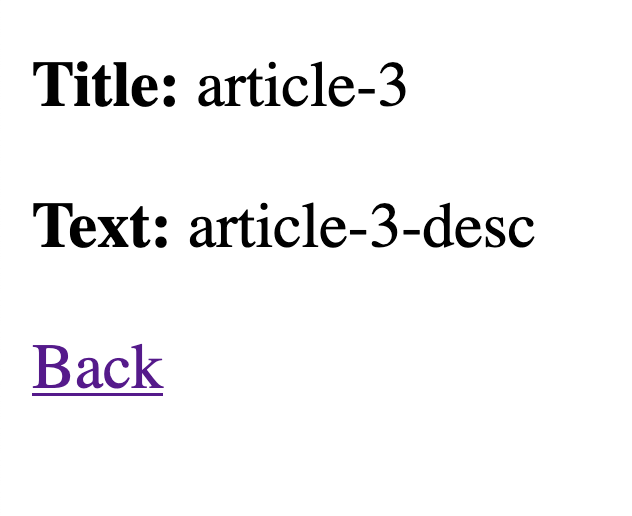
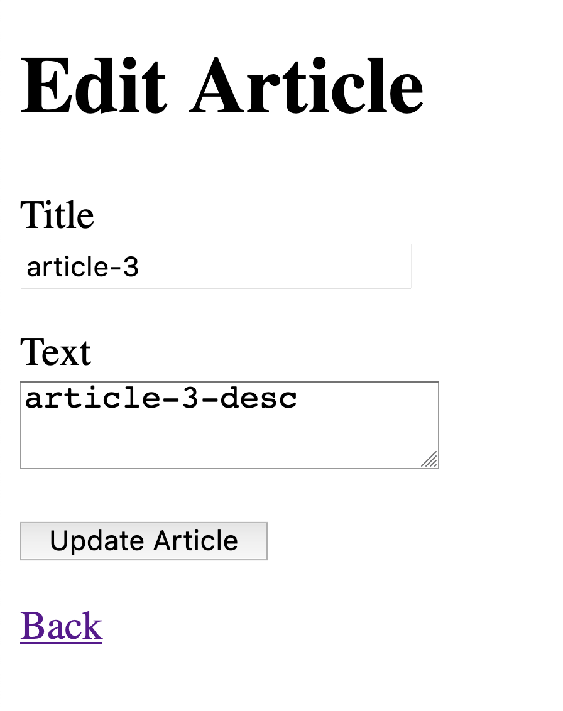

# README

This App is based on Getting Started with Rails Guide (https://guides.rubyonrails.org/getting_started.html).

## Installation

After clone it, just run the local server:

` $ rails server `

After that, open browser on http://localhost:3000/

## Features

- Welcome page:
<table><tr><td>
  
</td></tr></table>

- List items:
<table><tr><td>
  
</td></tr></table>

- Create an item:
<table><tr><td>
  
</td></tr></table>

- View an item:
<table><tr><td>
  
</td></tr></table>

- Edit an item:
<table><tr><td>
  
</td></tr></table>

- Delete an item:
<table><tr><td>
  
</td></tr></table>
